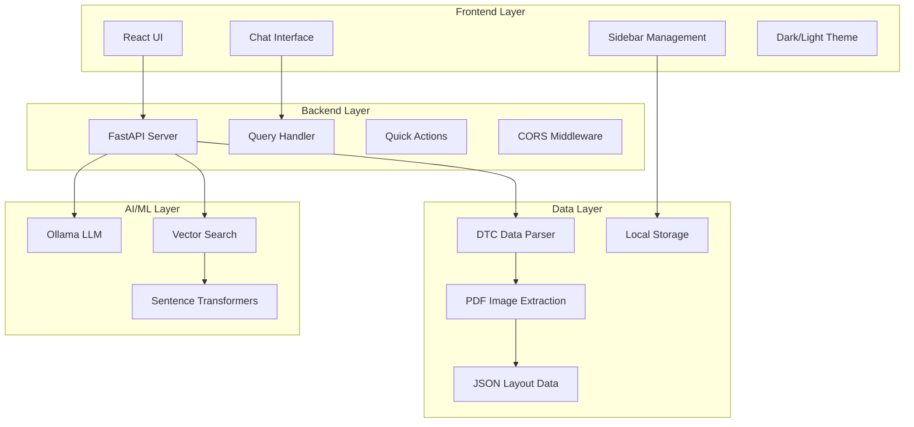
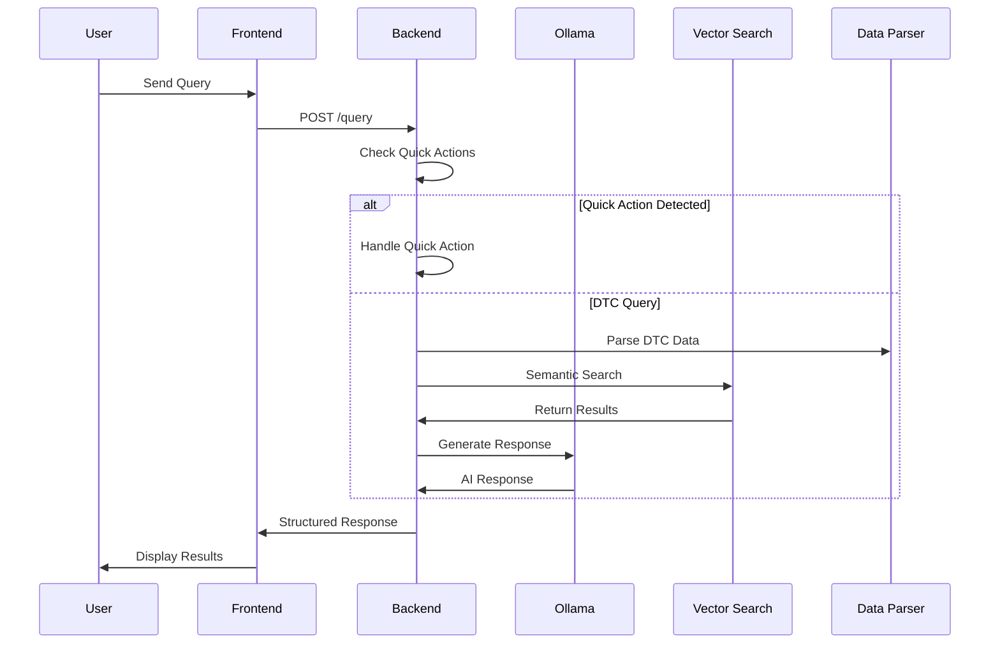
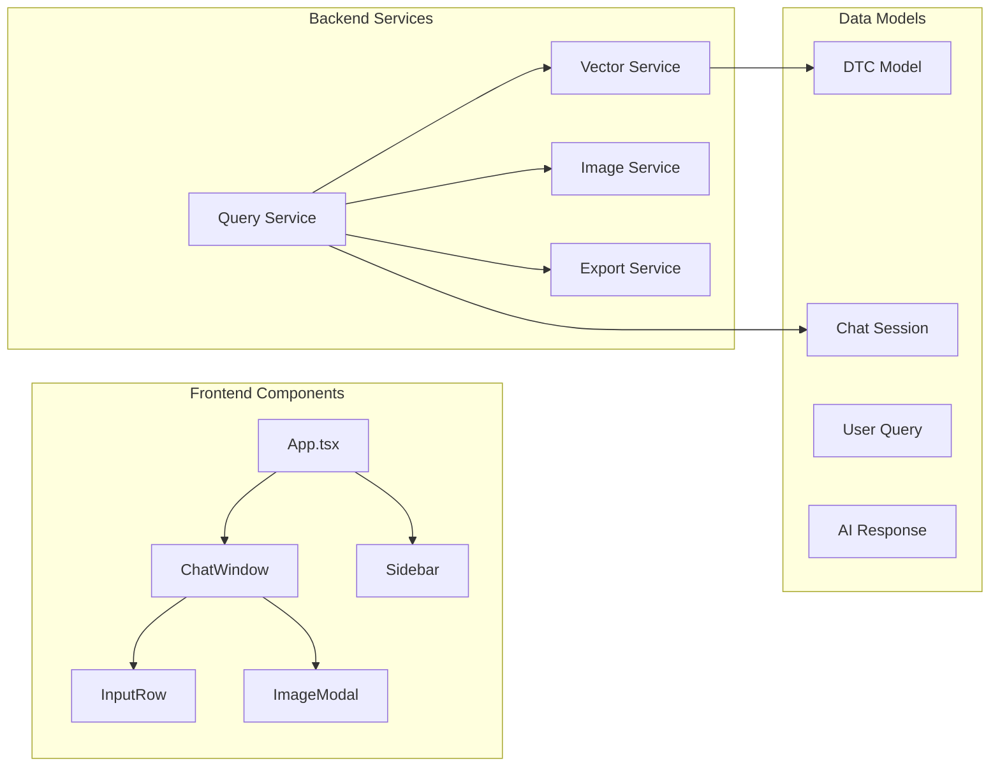
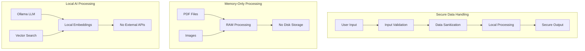
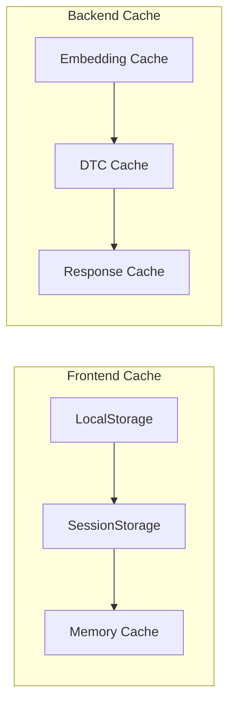
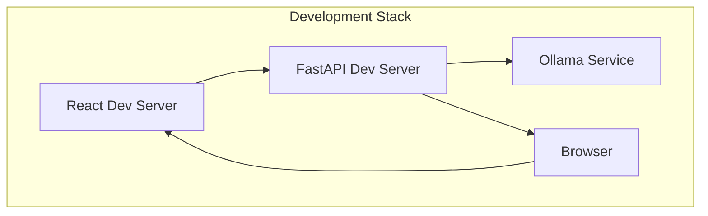

# DiaNav Architecture Documentation

This folder contains architecture diagrams and technical documentation for the DiaNav project.

## 🏗️ System Architecture

### High-Level Architecture

### Data Flow Architecture

### Component Architecture

## 🔐 Security Architecture

### Data Flow Security

## 📊 Performance Architecture

### Caching Strategy

## 🚀 Deployment Architecture

### Development Environment

## 📋 Architecture Decisions

### Technology Choices
- **Frontend**: React + TypeScript for type safety and modern development
- **Backend**: FastAPI for high performance and automatic API documentation
- **AI**: Ollama for local LLM processing without external dependencies
- **Vector Search**: Sentence-transformers for semantic search capabilities
- **Data Processing**: PyMuPDF for secure PDF image extraction

### Security Decisions
- **Local Processing**: All AI operations performed locally
- **Memory-Only**: Confidential images processed in RAM only
- **No External APIs**: No sensitive data sent to external services
- **Input Validation**: Comprehensive validation and sanitization

### Performance Decisions
- **Caching**: Local caching for embeddings and DTC data
- **Lazy Loading**: Images and data loaded on demand
- **Optimized Queries**: Efficient search algorithms
- **Responsive Design**: Optimized for various screen sizes 